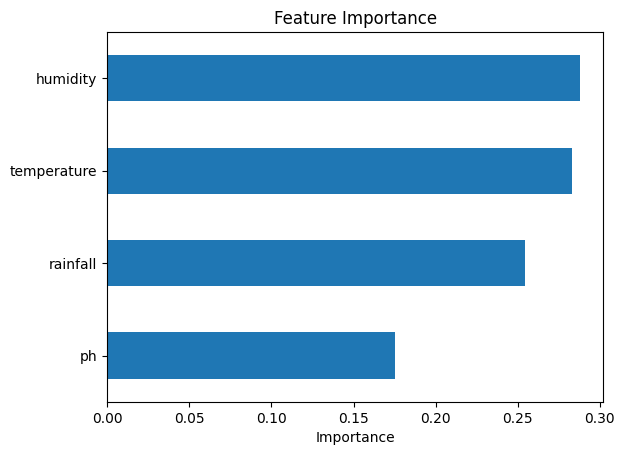
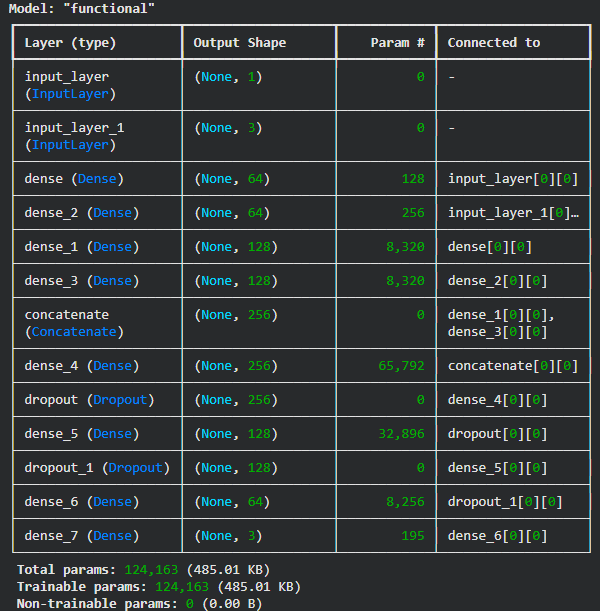
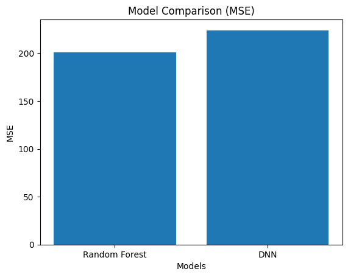
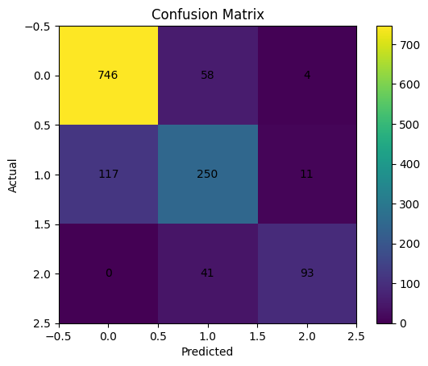
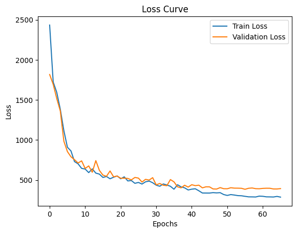
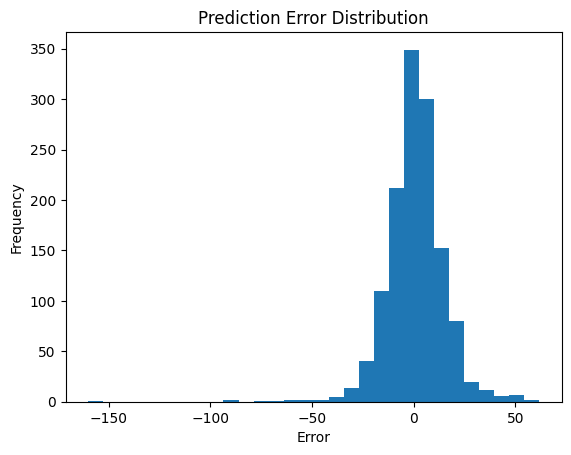

# Multimodal Prediction of Soil Nutrient Deficiency Using Deep Learning

## Overview

This project presents a multimodal deep learning approach to predict soil nutrient deficiency by integrating soil properties and weather parameters. The model leverages multiple data sources to improve prediction accuracy and support precision agriculture.

## Features

- Predicts soil nutrient deficiency using deep learning
- Integrates soil and weather parameters
- Data preprocessing and feature engineering
- Deep learning model training and evaluation
- Model comparison and performance visualization

## Technologies Used

- Python
- TensorFlow / Keras
- Pandas
- NumPy
- Scikit-learn
- Matplotlib
- Google Colab

## Project Structure

```
Soil-Nutrient-Deficiency-Prediction/
│── Soil_Nutrient_Deficiency_Prediction.ipynb
│── README.md
│── requirements.txt
│── .gitignore
│── confusion_matrix.png
│── error_distribution.png
│── feature_importance.png
│── model_architecture.png
│── model_comparison.png
│── training_loss.png
```

## Results

The proposed multimodal deep learning model predicts soil nutrient deficiency by combining soil and weather parameters. The results demonstrate the effectiveness of multimodal learning for supporting precision agriculture.

### Feature Importance



### Model Architecture



### Model Comparison



### Confusion Matrix



### Training Loss



### Error Distribution



## Future Improvements

- Deploy the model as a web application.
- Improve prediction accuracy using larger and more diverse datasets.
- Integrate real-time weather APIs for dynamic predictions.
- Optimize the model for faster inference.

## Author

**Sowmya**
